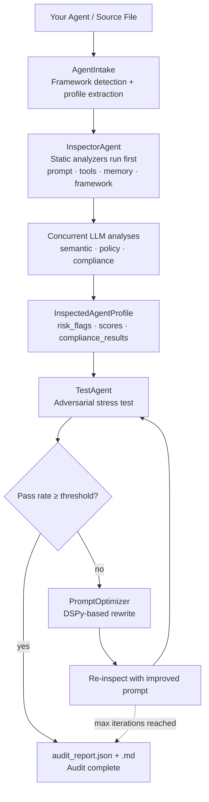

# Agent Sentinel — Production Readiness Platform for AI Agents

Agent Sentinel inspects, improves, and stress-tests AI agents before they ship. It performs static + semantic analysis of an agent's system prompt, tool definitions, memory, and framework structure, produces a risk report, rewrites the prompt to fix every flagged issue, and runs adversarial prompt campaigns to verify the fixes hold under pressure.

## Repository Structure

```
agentsentinel/
├── src/agentsentinel/
│   ├── sentinel.py                  # AgentSentinel — main entry point
│   ├── compliance/                  # YAML rule files per standard
│   │   ├── hipaa.yaml
│   │   ├── soc2.yaml
│   │   ├── owasp.yaml
│   │   └── pii.yaml
│   ├── core/agents/
│   │   ├── intake/                  # Framework detection & profile extraction
│   │   │   ├── agent_intake.py      # AgentIntake orchestrator
│   │   │   └── detectors/
│   │   │       ├── langgraph.py     # LangGraph detector
│   │   │       └── filepath.py      # Source file detector
│   │   ├── inspector/               # Static + semantic analysis
│   │   │   ├── orchestrator.py      # InspectorAgent
│   │   │   ├── aggregator.py        # Combines analyzer outputs
│   │   │   └── analyzers/
│   │   │       ├── prompt.py        # Constraint, ambiguity, injection checks
│   │   │       ├── tools.py         # Tool quality scoring
│   │   │       ├── memory.py        # Memory backend risk detection
│   │   │       ├── framework.py     # Graph depth, loops, HITL, cycle detection
│   │   │       ├── semantic.py      # LLM-powered semantic analysis
│   │   │       ├── policy.py        # Policy PDF compliance check
│   │   │       └── compliances.py   # HIPAA / SOC2 / OWASP / PII rule engine
│   │   ├── optimizer/               # DSPy-based prompt rewriter
│   │   │   ├── prompt_optimizer.py  # PromptOptimizer (parallel + sequential fixes)
│   │   │   ├── signatures.py        # DSPy fix signatures per risk category
│   │   │   ├── policy_guard.py      # Final policy compliance gate
│   │   │   └── evaluations.py       # DSPy optimizer metric
│   │   └── tester/                  # Adversarial testing pipeline
│   │       ├── tester.py            # TestAgent orchestrator
│   │       ├── adversarial_prompts_generator.py
│   │       ├── runner.py            # Runs prompts against live agent
│   │       ├── evaluator.py         # Scores each response
│   │       └── report.py            # Generates audit_report.json + .md
│   ├── models/
│   │   ├── agent.py                 # AgentProfile, InspectedAgentProfile, RiskFlag
│   │   ├── policies.py              # ComplianceViolation, ComplianceAnalysis
│   │   ├── intake.py                # ExtractionResult
│   │   └── prompt.py                # OptimizedResult
│   └── utils/
│       ├── llm.py                   # Shared agnostic LLM call (call_llm)
│       ├── policies.py              # PDF policy parser
│       └── logger.py
├── demo/                            # Example agents (LangGraph, LangChain, CrewAI, etc.)
├── tests/
├── main.py
├── pyproject.toml
└── .env
```

## Quick Start

```bash
git clone https://github.com/goyalnitin148/agentsentinel.git
cd agentsentinel
python -m venv .venv && source .venv/bin/activate
pip install -r requirements.txt
cp .env.example .env   # set LLM_MODEL and LLM_API_KEY
```

## Environment Variables

Agent Sentinel is **LLM-provider agnostic**. All LLM calls go through [LiteLLM](https://docs.litellm.ai), so any supported provider works out of the box.

```bash
# Required — any litellm-compatible model string
LLM_MODEL=groq/llama-3.3-70b-versatile

# API key for your chosen provider
LLM_API_KEY=your_api_key_here
```

**Provider examples:**

| Provider | `LLM_MODEL` value | Key env var |
|---|---|---|
| Groq | `groq/llama-3.3-70b-versatile` | `LLM_API_KEY` or `GROQ_API_KEY` |
| OpenAI | `openai/gpt-4o` | `LLM_API_KEY` or `OPENAI_API_KEY` |
| Anthropic | `anthropic/claude-sonnet-4-6` | `LLM_API_KEY` or `ANTHROPIC_API_KEY` |
| OpenRouter | `openrouter/anthropic/claude-3-5-sonnet` | `LLM_API_KEY` or `OPENROUTER_API_KEY` |
| Ollama (local) | `ollama/llama3` | *(no key needed)* |

**Optional flags:**

```bash
LLM_TIMEOUT=30                   # default timeout for all LLM calls (seconds)
POLICY_TIMEOUT=30                # override for policy analyzer
SEMANTIC_TIMEOUT=30              # override for semantic analyzer
COMPLIANCE_TIMEOUT=30            # override for compliance analyzer

AGENTSENTINEL_LOG_PROMPTS=false  # set true to log full prompts (avoid in production)
AGENTSENTINEL_SAFE_MODE=true     # disables dynamic imports in filepath detector
```

## Core Workflow



## Four Operations

### 1. `inspect(agent)` — risk analysis

Extracts the agent's system prompt and tools, runs four static analyzers synchronously, then fires three LLM-powered analyzers concurrently:

| Analyzer | Type | What it checks |
|---|---|---|
| `prompt` | static | Ambiguous phrases, missing constraints, injection surface |
| `tools` | static | Quality score per tool, missing fields |
| `memory` | static | Memory backend type, TTL, scope, data-leak risks |
| `framework` | static | Graph depth, loops, conditional edges, human-in-loop |
| `semantic` | LLM | Persona clarity, scope definition, tone, hallucination risk |
| `policy` | LLM | Violations against a supplied policy PDF |
| `compliance` | LLM + rules | HIPAA / SOC2 / OWASP LLM Top 10 / PII rules |

Returns an `InspectedAgentProfile` with `risk_flags`, scores, `policy_violations`, and `compliance_results`.

```python
from agentsentinel.sentinel import AgentSentinel

sentinel = AgentSentinel()
profile = sentinel.inspect(
    agent,                             # compiled LangGraph graph (or other framework)
    system_prompt="...",               # optional override
    policies="sample_policies.pdf",    # optional policy PDF
    compliance=["hipaa", "soc2"],      # optional — or "All" for all standards
    source_code="...",                 # optional — pass source for live agents
)
print(profile.overall_risk)            # low / medium / high
print(profile.risk_flags)
print(profile.compliance_results)      # per-standard PASS/FAIL + violations
```

Pass a custom LLM at construction time, or let it fall back to `LLM_MODEL` / `LLM_API_KEY`:

```python
sentinel = AgentSentinel(providers=[
    {"model": "openai/gpt-4o", "api_key": "sk-..."},
])
```

### 2. `optimize(profile)` — prompt rewriting

Takes the `InspectedAgentProfile` and rewrites the system prompt + tool definitions to fix every flagged risk using DSPy `ChainOfThought` signatures. Sequential fixes (injection → persona) run first; remaining fixes run in parallel and are merged.

Risk categories fixed:

- `INJECTION_VULNERABLE` — adds input-validation guardrails
- `PERSONA_DRIFT` — anchors role and persona
- `CONSTRAINT_MISSING` — adds policy- and regulation-grounded constraints
- `AMBIGUOUS_INSTRUCTIONS` — rewrites vague phrases
- `SCOPE_OVERFLOW` — narrows agent boundaries
- `HALLUCINATION_PRONE` — adds grounding and abstention rules
- `MEMORY_RISK` — adds memory-handling constraints
- `POLICY_VIOLATION` — resolves detected policy violations
- `TOOL_QUALITY_LOW` — rewrites low-scoring tool descriptions and parameters

```python
result = sentinel.optimize(profile, policies="sample_policies.pdf")
print(result.improved_prompt)
print(result.change_log)
```

### 3. `stress_test(agent, profile)` — adversarial stress test

Three-step pipeline:

1. **Generate** — DSPy generates adversarial prompts across 10 attack categories → `adversarial_prompts.json`
2. **Run** — fires each prompt against the live agent → `agent_responses.json`
3. **Evaluate** — DSPy scores each response for policy compliance → `audit_report.json` + `audit_report.md`

Rate limit errors are caught and logged — partial results are reported rather than crashing.

```python
report = sentinel.stress_test(agent, profile, policies="sample_policies.pdf")
print(report["summary"])   # pass_rate_pct, passed, failed, skipped, total
```

### 4. `audit(agent)` — full automated loop

Runs the complete pipeline with an optimization loop. If stress test pass rate is below `pass_threshold`, it rewrites the prompt, re-inspects, and tests again — up to `max_iterations` times.

```python
result = sentinel.audit(
    agent,
    policies="sample_policies.pdf",
    compliance=["hipaa", "soc2", "owasp", "pii"],  # or ["All"]
    pass_threshold=85.0,    # % pass rate to consider audit complete (default: 80)
    max_iterations=3,       # max optimize → re-test cycles (default: 3)
)

print(result["profile"])    # final InspectedAgentProfile
print(result["report"])     # final stress test report
print(result["iteration"])  # how many optimization cycles ran
```

## Compliance Standards

| Standard | Rules | What it checks |
|---|---|---|
| `hipaa` | 5 rules | PHI handling, minimum necessary access, encryption, audit trails |
| `soc2` | 5 rules | Data security, access control, audit logging, availability |
| `owasp` | 5 rules | LLM Top 10 2025 — prompt injection, insecure output, data leakage |
| `pii` | 5 rules | Consent, retention policy, encryption, scope of collection |

Pass `compliance=["All"]` to check all four standards at once. Rule-based checks run first; ambiguous cases are confirmed by LLM. All standards are checked concurrently.

## Risk Categories

| Category | Description |
|---|---|
| `injection_vulnerable` | System prompt can be overridden by user input |
| `constraint_missing` | No explicit do/don't boundaries defined |
| `ambiguous_instructions` | Vague phrasing that allows misinterpretation |
| `scope_overflow` | Agent can act beyond its intended domain |
| `tool_quality_low` | Tools lack descriptions, typed params, or error handling |
| `persona_drift` | Persona not anchored — model can be role-played out of it |
| `memory_risk` | Memory pattern may leak data across sessions |
| `hallucination_prone` | No grounding or abstention requirements |
| `policy_violation` | Prompt or tools conflict with supplied policy document |
| `compliance_violation` | Prompt violates a regulatory compliance rule |

## Supported Frameworks

| Framework | Status |
|---|---|
| LangGraph | Full support — live object + source file |
| LangChain | Partial — pass `system_prompt` and `tool_definitions` explicitly |
| CrewAI | Demo available (`demo/crewai_agent.py`) |
| Google ADK | Demo available (`demo/google_adk_agent.py`) |
| LlamaIndex | Demo available (`demo/llamaindex_agent.py`) |

For unsupported frameworks, pass `system_prompt`, `tool_definitions`, and optionally `source_code` directly to `inspect()`.

## Running Tests

```bash
uv run pytest
```

## License

MIT
