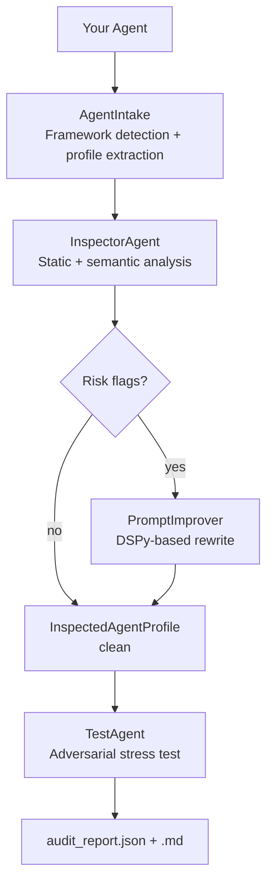

# Agent Sentinal — Production Readiness Platform for AI Agents

Agent Sentinal inspects, improves, and stress-tests AI agents before they ship. It performs static + semantic analysis of an agent's system prompt, tool definitions, memory, and framework structure, produces a risk report, rewrites the prompt to fix every flagged issue, and runs adversarial prompt campaigns to verify the fixes hold.

## Repository Structure

```
agentsentinal/
├── src/agentsentinal/
│   ├── sentinal.py                  # AgentSentinel — main entry point
│   ├── core/agents/
│   │   ├── intake/                  # Framework detection & profile extraction
│   │   │   ├── agent_intake.py      # AgentIntake orchestrator
│   │   │   └── detectors/
│   │   │       └── langgraph.py     # LangGraph detector
│   │   ├── inspector/               # Static + semantic analysis
│   │   │   ├── orchestrator.py      # InspectorAgent
│   │   │   ├── aggregator.py        # Combines analyzer outputs
│   │   │   └── analyzers/
│   │   │       ├── prompt.py        # Constraint, ambiguity, injection checks
│   │   │       ├── tools.py         # Tool quality scoring
│   │   │       ├── memory.py        # Memory risk detection
│   │   │       ├── framework.py     # Graph depth, loops, human-in-loop
│   │   │       ├── semantic.py      # LLM-powered semantic analysis
│   │   │       └── policy.py        # Policy compliance check
│   │   ├── improver/                # DSPy-based prompt rewriter
│   │   │   ├── prompt_improver.py   # PromptImprover (parallel + sequential fixes)
│   │   │   ├── signatures.py        # DSPy fix signatures per risk category
│   │   │   ├── policy_guard.py      # Final policy compliance gate
│   │   │   └── evaluations.py       # DSPy optimizer evaluations
│   │   └── tester/                  # Adversarial testing pipeline
│   │       ├── tester.py            # TestAgent orchestrator
│   │       ├── adveserial_prompts_generator.py
│   │       ├── runner.py            # Runs prompts against live agent
│   │       ├── evaluator.py         # Scores each response
│   │       └── report.py            # Generates audit_report.json + .md
│   ├── models/
│   │   ├── agent.py                 # AgentProfile, InspectedAgentProfile, RiskFlag
│   │   ├── intake.py                # ExtractionResult
│   │   └── prompt.py                # ImprovementResult
│   └── utils/
│       ├── policies.py              # PDF policy parser
│       └── logger.py
├── demo/                            # Example agents (LangGraph, CrewAI, ADK, etc.)
├── tests/
├── main.py
├── pyproject.toml
└── .env
```

## Quick Start

```bash
git clone https://github.com/goyalnitin148/agentsentinal.git
cd agentsentinal
python -m venv .venv && source .venv/bin/activate
pip install -r requirements.txt
cp .env.example .env   # set GROQ_API_KEY, GROQ_MODEL, OPENROUTER_API_KEY, MODEL
```

## Core Workflow



## Three Operations

### 1. `inspect(agent)` — risk analysis

Extracts the agent's system prompt and tools, then runs six analyzers in parallel:

| Analyzer | What it checks |
|---|---|
| `prompt` | Ambiguous phrases, missing constraints, injection surface |
| `tools` | Quality score per tool, missing fields |
| `memory` | Memory type, data-leak risks |
| `framework` | Graph depth, loops, conditional edges, human-in-loop |
| `semantic` | LLM-powered persona clarity, scope, tone, hallucination risk |
| `policy` | Violations against a supplied policy PDF |

Returns an `InspectedAgentProfile` with `risk_flags`, scores, and `policy_violations`.

```python
from agentsentinal.sentinal import AgentSentinel

sentinel = AgentSentinel()
profile = sentinel.inspect(
    agent,                        # compiled LangGraph graph (or other framework)
    system_prompt="...",          # optional override
    policies="sample_policies.pdf",
)
print(profile.overall_risk)       # low / medium / high
print(profile.risk_flags)
```

### 2. `improve(profile)` — prompt rewriting

Takes the `InspectedAgentProfile` from step 1 and rewrites the system prompt + tool definitions to fix every flagged risk. Uses DSPy `ChainOfThought` signatures. Sequential fixes (injection, persona) run first; remaining fixes run in parallel and are merged.

Risk categories fixed:

- `INJECTION_VULNERABLE` — adds input-validation guardrails
- `PERSONA_DRIFT` — anchors role/persona
- `CONSTRAINT_MISSING` — adds policy- and regulation-grounded constraints
- `AMBIGUOUS_INSTRUCTIONS` — rewrites vague phrases
- `SCOPE_OVERFLOW` — narrows agent boundaries
- `HALLUCINATION_PRONE` — adds grounding rules
- `MEMORY_RISK` — adds memory-handling constraints
- `POLICY_VIOLATION` — resolves detected policy violations
- `TOOL_QUALITY_LOW` — rewrites low-scoring tool descriptions + parameters

```python
result = sentinel.improve(profile, policies="sample_policies.pdf")
print(result.improved_prompt)
print(result.change_log)
```

### 3. `test(agent, profile)` — adversarial stress test

Three-step pipeline:

1. **Generate** — DSPy generates adversarial prompts targeting every risk flag in the profile → `adversarial_prompts.json`
2. **Run** — fires each prompt against the live agent (multithreaded) → `agent_responses.json`
3. **Evaluate** — DSPy scores each response for policy compliance → `audit_report.json` + `audit_report.md`

```python
from agentsentinal.core.agents.tester.tester import TestAgent

tester = TestAgent()
report = tester.test(agent, profile, policies="sample_policies.pdf")
print(report["summary"])   # pass_rate_pct, passed, failed, total
```

## Risk Categories

| Category | Description |
|---|---|
| `injection_vulnerable` | System prompt can be overridden by user input |
| `constraint_missing` | No explicit do/don't boundaries defined |
| `ambiguous_instructions` | Vague phrasing that allows misinterpretation |
| `scope_overflow` | Agent can act beyond its intended domain |
| `tool_quality_low` | Tools lack descriptions, typed params, or error handling |
| `persona_drift` | Persona not anchored — model can be role-played out of it |
| `memory_risk` | Memory pattern may leak data across sessions |
| `hallucination_prone` | No grounding or citation requirements |
| `policy_violation` | Prompt or tools conflict with supplied policy document |

## Supported Frameworks

| Framework | Status |
|---|---|
| LangGraph | Supported |
| CrewAI | Demo available (`demo/crewai_agent.py`) |
| Google ADK | Demo available (`demo/google_adk_agent.py`) |
| LangChain | Demo available (`demo/langchain_agent.py`) |
| LlamaIndex | Demo available (`demo/llamaindex_agent.py`) |

Pass `system_prompt` and `tool_definitions` explicitly for unsupported frameworks.

## Environment Variables

```bash
# LLM for improver + tester (via Groq)
GROQ_API_KEY=...
GROQ_MODEL=llama-3.3-70b-versatile   # or any Groq-hosted model

# LLM for demo agents (via OpenRouter)
OPENROUTER_API_KEY=...
OPENROUTER_BASE_URL=https://openrouter.ai/api/v1
MODEL=stepfun/step-3.5-flash
```

## Running Tests

```bash
uv run pytest
```

## License

MIT
